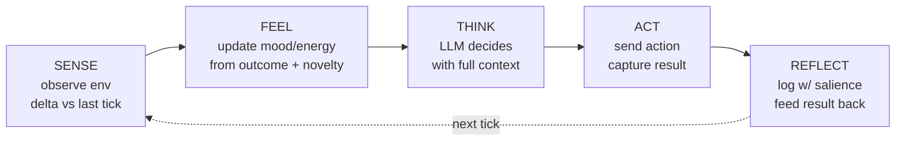
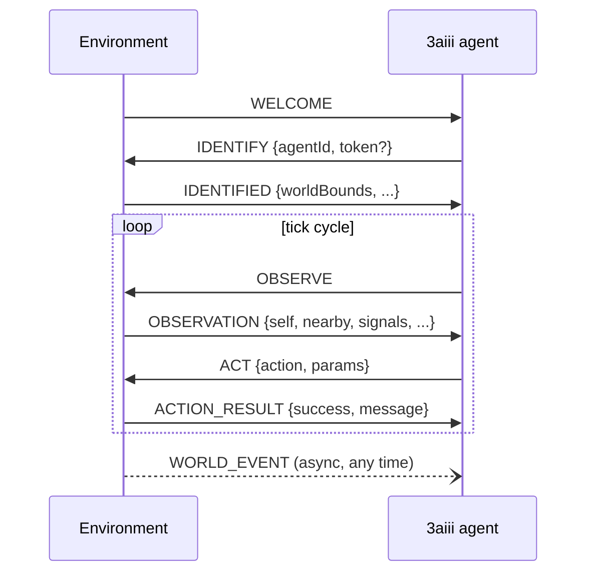

# 3aiii - Overview

A cognitive runtime for autonomous agents.

The name is a play on the operator's other product line, **3eyes**. Where 3eyes is the front-facing brand, **3aiii** is the underlying cognition. The hidden "AI" in three letters. The inside of the head, behind the eyes.

This doc covers what the system is, the architecture, what's live, what's proven, and what's left to make it enterprise-presentable.

---

## 1. The pitch in one paragraph

Most "AI agents" today are stateless prompt loops dressed up, and the moment you take the human supervisor out of the loop they collapse into repetition. **3aiii is different.** It's a cognitive substrate that gives an LLM-backed agent a five-stage perception loop, an internal emotional state, a memory that consolidates while it sleeps, a persona that evolves on its own over time, and (critically) a constraint discipline that prevents the fixation collapse other frameworks fall into the moment they're left to run. It currently runs locally on a Raspberry Pi for cents per hour, but the runtime is plain Node.js and runs equally well on any machine or in the cloud. It's been through numerous 9-12 hour soak runs, the most representative ticking 1,702 times, generating 449 utterances, sleeping ten times, and producing measurably different behaviour from start to finish. The same runtime can drive a 3D character, a sensor-grounded physical agent, a music synth, a chat participant, or any other environment (digital or physical) that can speak its protocol.

It's what an agent looks like when you stop treating it as a function call and start treating it as a process.

---

## 2. Why this exists, and why it's different

### 2.1 The problem with current agents

Modern agent frameworks (LangChain, AutoGen, Eliza, MetaGPT, LangGraph, OpenClaw, Hermes) have made real progress on memory, continuity, and tool use. The newer ones genuinely do remember things across sessions and can reason about prior conversations.

But there's one failure mode that consistently bites agents the moment they're taken off the leash: **repetition collapse.** Run any modern agent in a long-horizon loop with no human supervisor and it fixates. It'll move to the same place ten times in a row, repeat the same phrase, ask the same question. The reason is structural. "Decide what to do next" prompted against a stable context window produces the highest-probability completion, which is usually whatever the agent just did. Memory and tool use don't fix it, they just give the agent more rope.

This is the gap 3aiii is built to close. Where other systems address memory and continuity, 3aiii adds an explicit anti-fixation discipline (the repetition guard, see section 3.2), an internal emotional state that grounds decisions in felt consequence rather than pure probability, and a sleep-cycle consolidation pattern that resets attention rather than letting the prompt window drift. Some of these ideas exist in pieces across the agent ecosystem. 3aiii's contribution is composing them into a single autonomous loop that holds up under unsupervised long-horizon operation.

### 2.2 What we built instead

A cognitive loop with five distinct stages, each backed by a dedicated module:



- **SENSE** observes the environment and runs a delta against the previous tick. The agent doesn't just see the world, it sees what *changed* in the world.
- **FEEL** updates a two-axis internal state (mood and energy) based on novelty, action outcome, and environmental signal. The agent doesn't *compute* that something is interesting, it *feels* a spike of energy and that feeling enters the next prompt.
- **THINK** is the LLM call, with a prompt that includes the current internal state, recent deltas, the result of the last action, any repetition warnings, and the persona's voice rules.
- **ACT** issues an environment action (move, speak, manipulate) and captures whether it succeeded.
- **REFLECT** logs the tick with a salience score, feeds the action result back into next tick's FEEL, and rotates daily logs.

Every 4 hours of waking life, the agent **sleeps for an hour**. During sleep four passes happen: memory consolidation, skill extraction, tool refresh, and self-reflection. The persona file itself gets rewritten (subtly) based on what kind of day the agent had. A drift guard stops runaway change.

This isn't "more prompt engineering". It's a different shape of process.

### 2.3 What this unlocks

- **Autonomy without micromanagement.** Boot the agent. Walk away. Three days later it has formed relationships with objects in its world, refined its voice, learned procedural skills. Nothing external is driving it.
- **Hardware-grounded operation.** The runtime is small enough to live on a Raspberry Pi 5 at the edge. Local-model fallback when the cloud LLM is unreachable. Pull the wifi and the agent slows down but keeps running.
- **Pluggable to anything.** The environment protocol is a standard WebSocket contract. The same runtime has driven a 3D character, a hardware sensor stream, a music synth, a chat participant, and a large-scale physical installation. And in principle anything else (digital or physical) that speaks the protocol.
- **Cost discipline.** Tiered LLM routing (high-quality model for consequential decisions, fast cheap model for routine ticks, local Ollama as fallback) keeps cost-per-tick at fractions of a cent. A Pi running one agent 24/7 stays well inside hobbyist budgets.

---

## 3. Architecture

### 3.1 Module layout

```
src/
  loop/
    Heartbeat.js           adaptive 4-15s tick, tied to energy
    SleepCycle.js          4h wake / 1h sleep, four-pass consolidation
  cognition/
    InternalState.js       mood/energy feel-machine
    DeltaDetector.js       narrates what changed in the world
    RepetitionGuard.js     detects fixation, surfaces it to the LLM
    Think.js               assembles context, calls the LLM, parses
    Perceive.js            renders observation as natural language
    FallbackBrain.js       heuristic action selection when no LLM
  memory/
    WorkingMemory.js       20-entry RAM ring buffer, salience-weighted
    MemoryFiles.js         persistent markdown: memory, skills, tools
    DailyLog.js            rotating per-day activity logs (7-day GC)
    SpeechLog.js           utterance tracking for repetition + creativity
  llm/
    LLMClient.js           tiered routing: cloud quality / cloud fast / local
    PromptBuilder.js       persona-aware prompt assembly
  connection/
    EnvironmentSocket.js   WebSocket protocol, reconnect, buffering
  api/
    ApiServer.js           HTTP + Server-Sent Events
  logging/
    logger.js              levelled console output
  util/
    sanitizeJson.js        defensive JSON parsing for LLM output
```

Each module is intentionally small (200-300 lines) and has a single responsibility. The whole runtime is around three thousand lines of JavaScript with three direct npm dependencies (`ws`, `ollama`, `dotenv`). No transpilation step. No framework lock-in.

### 3.2 The cognitive pipeline in detail

#### Internal state

The agent has a two-axis felt sense:

- **Mood** (-1 to +1): bad ↔ good. Pushed by action outcomes (failure is sharp at -0.15, success gentle at +0.02. The asymmetry is intentional, mirrors how negative experience disciplines attention more than positive experience), environmental signals (vitality, danger), social events.
- **Energy** (-1 to +1): calm ↔ excited. Spiked by novelty (delta detection), sustained by environmental signal strength, decays naturally toward zero in the absence of stimulation.

These values aren't instructions to the LLM. They're *sensations* the environment causes. The persona and the LLM together decide what to do about them. A high-mood-high-energy "Victor"-type persona (our flagship reference persona, introduced in section 3.4) might become spontaneous and bold. A low-mood-high-energy "Victor" might become anxious and protective. The framework provides the felt sense, the persona provides the response.

The internal state is checkpointed to disk continuously, so the agent recovers gracefully across crashes and restarts.

#### Delta detection

The agent doesn't just see what's there, it sees what's different. Each tick the observation is diffed against the previous tick. New agents appearing, objects vanishing, properties mutating, signals shifting. All surface as natural-language narration in the next prompt: *"New object: terminal-01 appeared"* or *"resonance increased (0.30 → 0.70)"*. The LLM gets change, not state.

#### Repetition guard

The runtime tracks the last twenty actions. Three same-action-in-a-row, or one action exceeding sixty percent of recent history, or three exact duplicates inside the last five ticks. All trip a warning that gets surfaced into the next prompt: *"You've tried 'move_to' four times in a row. Consider something else."* This is a constraint, not an instruction. The philosophy is that constraints create creativity. An agent told to "be creative" produces vague output. An agent told it cannot do the boring thing has to find a new thing.

#### Adaptive heartbeat

The tick interval moves between 4 seconds and 15 seconds based on current energy. High energy (something is happening) means faster ticking. Low energy (the world is static) means slower ticking, conserving compute and money. The tick is implemented as a `setTimeout` chain rather than `setInterval`, which lets the runtime capture each action's result before the next tick begins. The result becomes part of the next FEEL phase.

#### Sleep cycle

Every four hours of waking activity the agent sleeps for an hour. Four passes during sleep:

1. **Memory consolidation.** The LLM rewrites `memory.md` (the agent's relationships, learned facts, salient memories) by compressing four hours of working memory into durable form.
2. **Skill extraction.** The LLM reviews the daily log and distills procedural patterns into `skills.md` (eg "interact({target: 'pillar-01'})", "move_to({x: 10, z: 20}) circles back when anxious").
3. **Tool refresh.** The runtime re-reads the observation schema and updates `tools.md` with currently available actions and discovered objects.
4. **Self-reflection.** The LLM reviews the internal-state history from the day (average mood, average energy, peaks, range) plus the persona, and proposes subtle evolution. Traits, quirks, values, fears can shift. Name and backstory cannot. The proposed changes get written back to the persona JSON with a timestamped log entry. A drift guard measures distance from the immutable baseline persona file and rejects runaway changes.

When the agent wakes it has a slightly different self than when it went to sleep. Over weeks this produces meaningful character development.

### 3.3 Memory model

Three layers, each with a clear role:

| layer | medium | what it holds | written when |
|---|---|---|---|
| Working memory | RAM ring buffer (20 entries) | actions, deltas, speech, sleep markers | every tick |
| Daily log | markdown file per day, 7-day retention | full activity stream | every tick, GC'd in sleep |
| Memory files | three markdown files (`memory.md`, `skills.md`, `tools.md`) | consolidated long-term knowledge | during sleep cycles |

High-energy moments are tagged with a salience marker and weighted heavier during consolidation. Lookups during the prompt-build phase read from the persistent files (with an in-memory cache to avoid disk thrashing every tick).

This is the architecture difference between "the agent remembers" and "someone gave the agent a longer context window". The latter is shallow context recall. The former is consolidation, abstraction, and selective forgetting.

### 3.4 Persona system

A persona is a JSON file. Six are shipped today, with **"Victor"** as the flagship reference persona that most of the soak-test data is drawn from. The other five ("Pip", "Bean", "Mochi", "Taro", "Sharay") are deliberately diverse in voice, values, and energy. They stress-test that the cognitive substrate works across different character archetypes rather than only fitting one. Each persona file defines:

- **Identity**: id, name
- **Character**: traits, values, fears, quirks
- **Voice**: prose style, vocabulary anchors, signature phrasings
- **Backstory**: rich narrative grounding the character

Personas are loaded at boot and live-swappable via the `PUT /persona` HTTP endpoint. The PromptBuilder weaves the persona into the system prompt, and the persona shapes how the LLM responds to the same internal state. A "Victor" reacting to high-energy-low-mood will feel and sound different from a "Pip" in the same state.

The sleep-cycle self-reflection rewrites the persona JSON in place, producing slow drift over weeks. A baseline copy is preserved immutably, and the drift guard limits how far the live persona can diverge before changes are rejected. This produces a recognisable character that nonetheless develops.

### 3.5 LLM provider routing

Three tiers, automatic fallback:

| tier | use case | provider | latency | cost per call |
|---|---|---|---|---|
| Quality | sleep consolidation, complex decisions | cloud 70B-class (Groq `gpt-oss-120b`) | ~10s | ~1.5¢ |
| Fast | routine ticks | cloud 8B-class (`gpt-oss-20b`) | ~2-3s | ~0.3¢ |
| Local | offline fallback | Ollama (configurable, `qwen2.5:3b` default) | ~30-60s on Pi | free |
| Skip | no LLM available | `FallbackBrain.js` heuristic | < 100ms | free |

A 429 (rate limit) response from the cloud triggers a 60-second cooldown and a fallback to local Ollama. Periodic re-checks bring the agent back to the cloud tier when limits clear. The runtime tracks per-tier call counts and emits them via the metrics endpoint, so operators can see exactly where their LLM spend is going.

### 3.6 Environment protocol

The agent connects to its world via a single WebSocket. The protocol is documented in `docs/ENVIRONMENT_PROTOCOL.md` and consists of:

- **Handshake**: `WELCOME` → `IDENTIFY` (with optional `ADMIN_TOKEN`) → `IDENTIFIED`
- **Tick loop**: server sends `OBSERVE` with the current world state, agent processes and replies with `ACT`
- **Async events**: `WORLD_EVENT` for things that don't fit the observation cycle (other agents speaking, objects spawning, signals firing)




The protocol is intentionally generic. The same runtime has driven a 3D character in a virtual world (see [kiwiexe.com](https://kiwiexe.com)), a sensor-grounded physical agent reading real-world inputs, a music synth responding to BPM and chord changes, a chat participant. And in principle anything else, digital or physical, that can speak the protocol. The agent doesn't know what its environment is, it just speaks the protocol, and the environment is whatever connects to it.

### 3.7 API surface

The runtime exposes a small HTTP API for operators and dashboards:

| method | path | purpose |
|---|---|---|
| GET | `/status` | current internal state, tick count, uptime, recent actions |
| GET | `/memory` | full content of memory.md, skills.md, tools.md |
| POST | `/memory/remember` | inject a memory entry into the agent's long-term store |
| GET | `/logs/today` | today's daily log (plain text) |
| POST | `/sleep` | trigger an immediate sleep cycle |
| POST | `/wake` | wake the agent from sleep early |
| PUT | `/persona` | hot-swap the active persona |
| GET | `/metrics` | runtime metrics (tier counts, consolidation timing, errors) |
| GET | `/events` | Server-Sent Events stream of all runtime events |

No external HTTP framework dependencies, the API is implemented directly on Node's built-in HTTP module.

---

## 4. Hardware deployment

### 4.1 Raspberry Pi 5

The reference deployment target is a Raspberry Pi 5. A bootstrap script (`setup-pi.sh`) takes a fresh Pi to running agent in one command. It installs Node 20, installs Ollama, clones the repo, configures the environment, and starts the agent under a process supervisor.

A Pi 5 with 4GB RAM is sufficient. Power draw is modest. The agent can run for weeks on the same SD card without intervention.

### 4.2 Multi-agent deployments

Each agent runs as its own process on its own port. To run multiple agents on the same machine, set `AGENT_ID`, `API_PORT`, and the persona path per-instance:

```bash
AGENT_ID=victor API_PORT=5000 npm start  # process 1
AGENT_ID=pip    API_PORT=5001 npm start  # process 2
AGENT_ID=bean   API_PORT=5002 npm start  # process 3
```

Each agent connects to the same shared environment server, so they all live in the same world. An agent can hear another agent speak (as a `WORLD_EVENT`), but the inter-agent communication contract is deliberately spartan. They relate to each other through the world, not through a private channel.

### 4.3 Cloud / containers

Cloud deployment works on any Linux host with Node 20 and Ollama. Containerisation isn't yet packaged (see audit, section 8).

---

## 5. What's been proven

### 5.1 Soak test results

The runtime has been through numerous 9-12 hour soak runs. Representative figures from one of the longer sessions:

| metric | value |
|---|---|
| total runtime | ~9 hours |
| ticks completed | 1,702 |
| utterances generated | 449 |
| sleep cycles | 10 |
| environmental phase changes | 5 |
| crashes | 0 |
| hallucinations (objects mentioned that werent in the world) | 0 |
| persona evolutions logged | 10 (one per sleep cycle) |
| skills learned | 15+ distinct movement and interaction patterns |
| relationships formed with in-world entities | 6 (Cloud, Monolith, Lantern, Oracle, Scout, Pond) |

Critically: the agent was *visibly* different at the end of the run than at the start. It had developed preferences. Returned to places that felt good. Alternated between bold and cautious in patterns that followed its mood trajectory. This is the emergent behaviour the architecture is designed to produce, and across multiple runs, it produced it consistently.

### 5.2 Tested coverage

The codebase ships with three test entry points:

- `test-suite.js` runs through controlled scenarios (object appears, action fails, speech heard, signal spike, repetition pressure) and validates that internal state moves the way the architecture predicts.
- `soak-test.js` runs the agent for hours under a phase-cycling test environment, exercising sleep cycles, memory consolidation, long-term stability.
- `test-server.js` is a minimal WebSocket environment server that lets any developer drive the agent through scripted observations.

The `test-results/` directory holds 70 prior test runs. The most recent batch is from mid-March 2026.

### 5.3 What's live

- six personas deployed and tested ("Victor" as flagship, plus "Pip", "Bean", "Mochi", "Taro", "Sharay")
- multiple multi-hour soak tests passing on Raspberry Pi
- environment protocol spec published, integrated with [kiwiexe.com](https://kiwiexe.com) and a real-time, large-scale physical installation at Ibiza's Botanical Gardens
- real-world sensor → agent → output loop demonstrated end-to-end
- HTTP API + SSE event stream operational
- tiered LLM routing with automatic fallback in production

---

## 6. Recent timeline

| version | shipped | what it added |
|---|---|---|
| v0.4 | Apr 2026 | Environment Protocol Standard; ADMIN_TOKEN support; first real-world sensor milestone |
| v0.3.10 | Apr 2026 | SpeechLog, stability hardening (promise leak fixes, day-boundary bugs) |
| v0.3.8 | Mar 2026 | Tiered LLM routing for cost optimisation |
| v0.3.7 | Mar 2026 | Stability backlog: 60s 429 cooldown, Ollama re-check, tick counter persistence |
| v0.3.5 | Mar 2026 | Experiential signals (the world sends "cool edge to air" instead of "temperature: 0.36") |
| v0.3.2 | Mar 2026 | Anti-repetition overhaul, fuzzy speech dedup |
| v0.2 | Mar 2026 | Cognitive redesign: SENSE/FEEL/THINK/ACT/REFLECT loop, InternalState, DeltaDetector, RepetitionGuard |
| v0.1 | Feb 2026 | Initial OBSERVE/THINK/ACT loop on a fixed timer |

The architecture is roughly six months old and has been continuously exercised. Each version closed a real failure mode found in the previous one.

---

## 7. Differentiation

Five things, ranked by how strongly we can claim them. Other modern agent frameworks have made progress on memory and continuity. The ones below are where 3aiii goes further or in a different direction.

### 7.1 Constraint-driven creativity (the repetition discipline)

**This is the strongest claim.** Most agent frameworks have no explicit anti-fixation mechanism. They rely on the LLM's distribution to avoid repetition, and it doesnt, especially over long horizons. 3aiii's repetition guard tracks the last twenty actions and surfaces fixation as a constraint into the next prompt: not "be creative" but "you cannot do that again." The shift from exhortation to constraint is meaningful, and as far as we've seen it isnt implemented this directly anywhere else in the public agent ecosystem.

### 7.2 Internal state as felt sense, not instruction

Some agent systems include "emotion" by injecting adjectives into prompts or computing a numeric score and describing it to the LLM. 3aiii models mood and energy as sensations the environment *causes*, with asymmetric feedback (failure sharper than success), natural decay, persona-shaped response. The agent doesn't *compute* that something is interesting, it gets an energy spike that enters the next prompt as part of its felt context. The difference shows up in long-horizon behaviour, not in single-turn output.

### 7.3 Environment-agnostic hardware grounding

The agent runs on a Raspberry Pi 5 today, with local Ollama as a fallback for when the cloud LLM is unreachable. The environment protocol is generic enough to drive a 3D character, a sensor stream, a music synth, a physical installation, or anything else (digital or physical) that can speak the protocol. Most agent frameworks treat embodied and edge deployment as a footnote. 3aiii is built for it as a first-class target.

### 7.4 Sleep-cycle consolidation and persona evolution

Memory consolidation during scheduled "sleep" exists in some form in other systems (MemGPT, Letta, the long-context-management work in newer agents). 3aiii's contribution is the combined cycle: memory → skill extraction → tool refresh → persona self-reflection, all in one explicit phase, with a drift guard that prevents the agent's character from running away from its baseline. The persona-evolution part is the less-common piece. Persona files rewrite themselves over time, and the agent at week four is recognisably the same character as week one but visibly developed.

### 7.5 Adaptive cognitive throttling

The 4-15 second tick interval, modulated by energy, means the agent ticks faster when something interesting is happening and slower when the world is static. Saves money (fewer LLM calls in boring conditions) and produces a more lifelike presence (the agent is more alert when there is more to be alert about).

---

## 8. Engineering audit

This section is the honest read on what the codebase needs to be enterprise-presentable. Not a list of weaknesses, a list of investments that turn an excellent reference implementation into a production product.

### 8.1 What's already in good shape

- Clean module boundaries, each cognitive component is single-responsibility and short
- Three production dependencies, no transpilation, fast cold-boot
- Six distinct personas already running, with documented evolution
- Environment protocol documented in spec form
- Soak-test evidence of multi-hour stability across multiple runs
- Bootstrap script (setup-pi.sh) takes bare hardware to running agent in one command

### 8.2 What's planned for production hardening

| item | current state | production-ready state | effort |
|---|---|---|---|
| API authentication | endpoints unauthenticated | token + signed-message gating on mutating routes | small (3-4 hrs) |
| Input validation | persona/action JSON loaded raw | Zod schema validation, error responses | small (3-4 hrs) |
| Rate limiting | none | per-IP + per-token limits on API | small (2-3 hrs) |
| CI / CD | no pipeline | GitHub Actions: lint, test, build, soak smoke | medium (6-8 hrs) |
| Health endpoint | `/status` exists but not orchestrator-friendly | dedicated `/health` returning 503 on degradation | trivial (1 hr) |
| Process supervision | setup-pi.sh starts agent but no systemd unit | systemd service with auto-restart, log rotation | small (2-3 hrs) |
| Containerisation | none | Dockerfile, docker-compose, optional Helm chart | medium (6-10 hrs) |
| Structured logging | console.log levels | JSON stdout, ready for log aggregation | small (3-4 hrs) |
| Metrics / observability | basic `/metrics` route | Prometheus format, OpenTelemetry traces, cost dashboard | medium (10-12 hrs) |
| Operations runbook | none | docs/runbook.md (debug, recover, monitor, rotate) | small (3-4 hrs) |
| LICENCE / SECURITY.md / CONTRIBUTING.md | none | drafted at repo root | trivial (1-2 hrs) |
| CHANGELOG | none — only git history | proper keep-a-changelog | trivial (1 hr) |
| Audit log middleware | none | append-only log of all memory/persona mutations | small (3-4 hrs) |

Total engineering effort to close out: **40-50 hours, two to three weeks of focused work**.

---

## 9. Roadmap to enterprise-ready

In priority order. Each item has a single sentence on why it matters.

1. **API authentication.** The mutating endpoints (`/persona`, `/memory/remember`, `/sleep`, `/wake`) accept anyone today. Lock them behind a token. Trivial, must-do.
2. **Health endpoint and process supervision.** Production agents need to die predictably and restart cleanly.
3. **Structured JSON logging.** Required for any aggregation pipeline.
4. **CI workflow.** Pre-merge lint, test, build checks are expected on any production codebase.
5. **Operations runbook.** Day-2 operations need to be a written-down procedure, not folklore.
6. **Dockerfile + container deployment story.** Removes integration friction for any host that isnt a Pi.
7. **Prometheus metrics + cost dashboard.** Visibility into spend is non-negotiable for production LLM workloads.
8. **Multiple multi-day soak tests + review on dedicated hardware.** Extends the existing 9-12 hour evidence base into multi-day stability data.
9. **Input validation (Zod) on persona / memory / action surfaces.**
10. **Rate limiting on API.** Defence in depth.
11. **Audit logging middleware.** Compliance baseline for any operational deployment.
12. **LICENCE, SECURITY.md, CONTRIBUTING.md, CHANGELOG.** Standard repository hygiene.

Items 1-5 are the minimum. 1-12 is the polished release.

---

## 10. Ownership and rights

### 10.1 Code

All source code in this repository is original work. The architecture is novel, the implementation is the operator's. No external contributors with retained rights. Third-party dependencies are MIT or Apache 2.0 licensed and permit unrestricted commercial use:

- `ws` (MIT) — WebSocket client for environment connection
- `ollama` (MIT) — local LLM inference client
- `dotenv` (BSD-2-Clause) — environment variable loading

That's the entire dependency tree. No framework lock-in.

### 10.2 Personas

The six shipped personas ("Victor", "Pip", "Bean", "Mochi", "Taro", "Sharay") are original creative work. Personas are JSON files, the format is open, so additional personas can be added without touching runtime code. The system accommodates as many distinct characters as the operator wants to author.

### 10.3 Environment protocol

The protocol specification (`docs/ENVIRONMENT_PROTOCOL.md`) is authored by the operator. 3aiii implements the client side, the server side is the responsibility of whatever environment the agent connects to. Reference integrations (kiwiexe.com, the Ibiza Botanical Gardens installation) are separate codebases and aren't part of this asset.

### 10.4 What transfers cleanly

- the git repository in full
- the bootstrap script (setup-pi.sh)
- the six personas
- the documentation set
- the test suites and historical test results
- the environment protocol specification
- any branding and naming associated with the runtime

The runtime is functional with or without any specific environment server, so the asset is transferable independent of the worlds it has been integrated with.

---

## 11. Live demonstration

A live demonstration can be set up or arranged at short notice. The typical walkthrough runs:

1. SSH into a Raspberry Pi 5 running the agent.
2. Show `journalctl -u agent-runtime -f` streaming live tick logs.
3. `curl http://pi.local:5000/status` to show current internal state.
4. Watch the SSE event stream at `http://pi.local:5000/events`.
5. Trigger a sleep cycle via `POST /sleep` and watch consolidation happen in real time.
6. Show `data/memory.md` before and after sleep, demonstrating the compression of working memory into long-term knowledge.
7. Hot-swap the persona via `PUT /persona` and watch the agent's voice change within one tick.

The whole demo takes around twenty minutes and shows every distinctive feature. It works because there's nothing fake about the system — everything in this document is observable in the running agent.

---

## 12. Contacts

For technical questions during review:

- Sam Skirrow — sam.skirrow@gmail.com
- repository: agent-runtime (private)
- reference deployment: Raspberry Pi 5
- live integrations: kiwiexe.com, Ibiza Botanical Gardens installation
